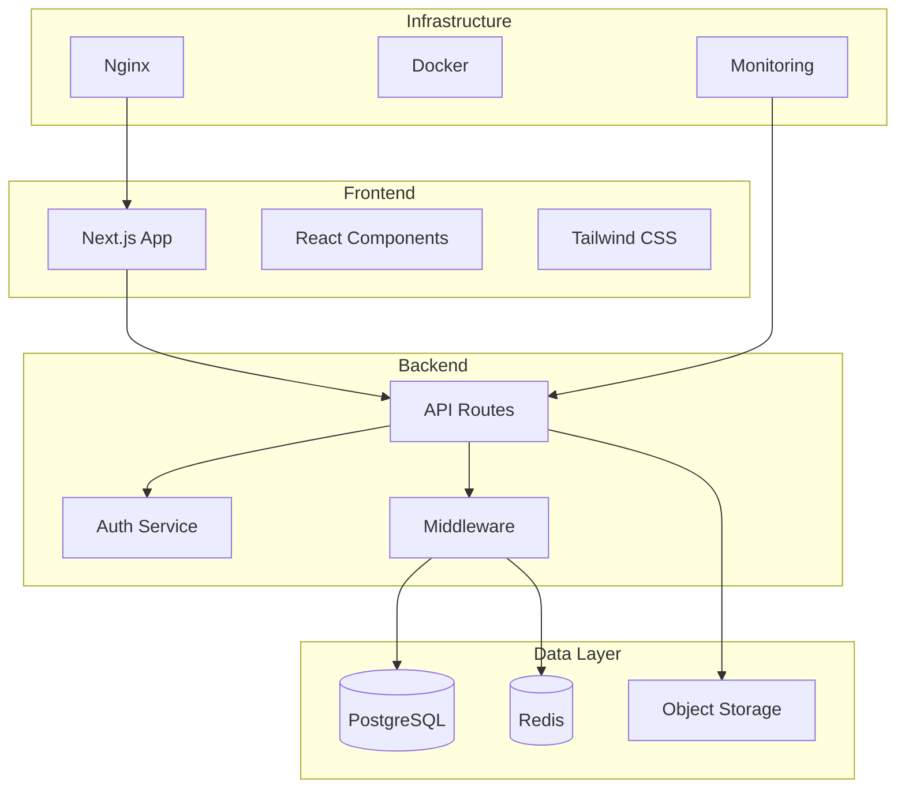

# MyBudget - Personal Finance Management Platform

<div align="center">
  
  
  
  [](https://github.com/mybudget/mybudget/actions/workflows/security.yml)
  [](https://github.com/mybudget/mybudget/actions/workflows/tests.yml)
  [](LICENSE)
  [](https://nodejs.org)
  
  **A secure, feature-rich personal finance management application built with Next.js, TypeScript, and PostgreSQL**
  
  [Demo](https://demo.mybudget.com) | [Documentation](docs/) | [API Reference](docs/API_DOCUMENTATION.md) | [Security](docs/SECURITY_THREAT_MODEL.md)
  
</div>

## 🌟 Features

### Core Functionality
- 💰 **Transaction Management** - Track income and expenses with categories and tags
- 📊 **Budget Planning** - Set and monitor budgets by category
- 🎯 **Savings Goals** - Create and track progress towards financial goals
- 📈 **Financial Insights** - AI-powered analytics and spending trends
- 📱 **Responsive Design** - Works seamlessly on desktop and mobile
- 🔄 **Real-time Updates** - WebSocket support for live data synchronization

### Security Features
- 🔐 **JWT Authentication** - Secure token-based auth with refresh tokens
- 🛡️ **Rate Limiting** - Adaptive rate limiting with Redis
- 🔒 **Data Encryption** - AES-256 encryption at rest
- 🚨 **Security Headers** - Comprehensive CSP, HSTS, and security policies
- 📝 **Audit Logging** - Complete audit trail of user actions
- 🔍 **Input Validation** - Strict validation using Zod schemas

## 🚀 Quick Start

### Prerequisites

- Node.js 20+ 
- PostgreSQL 15+
- Redis 7+
- Docker & Docker Compose (optional)

### Installation

1. **Clone the repository**
   ```bash
   git clone https://github.com/mybudget/mybudget.git
   cd mybudget
   ```

2. **Install dependencies**
   ```bash
   npm install
   ```

3. **Set up environment variables**
   ```bash
   cp env.template .env.local
   # Edit .env.local with your configuration
   ```

4. **Set up the database**
   ```bash
   npm run db:setup
   npm run db:migrate
   ```

5. **Start development server**
   ```bash
   npm run dev
   ```

Visit http://localhost:3000 to see the application.

### Using Docker

1. **Start all services**
   ```bash
   docker-compose up -d
   ```

2. **Run database migrations**
   ```bash
   docker-compose exec backend npm run db:migrate
   ```

3. **Access the application**
   - Frontend: http://localhost:3000
   - API: http://localhost:3001
   - Grafana: http://localhost:3002

## 📋 Environment Configuration

Create a `.env.local` file with the following variables:

```env
# Database
DB_HOST=localhost
DB_PORT=5432
DB_NAME=mybudget
DB_USER=mybudget_user
DB_PASSWORD=your_secure_password

# Redis
REDIS_HOST=localhost
REDIS_PORT=6379
REDIS_PASSWORD=your_redis_password

# Authentication
JWT_SECRET=your_super_secure_jwt_secret_at_least_32_chars
JWT_EXPIRES_IN=7d
JWT_REFRESH_EXPIRES_IN=30d

# Security
ALLOWED_ORIGINS=http://localhost:3000,https://yourdomain.com
TRUSTED_IPS=10.0.0.0/8
EXTERNAL_DOMAINS=cdn.example.com,api.external.com

# Monitoring (Optional)
SENTRY_DSN=your_sentry_dsn
LOG_LEVEL=info
```

## 🏗️ Architecture



## 🛠️ Development

### Available Scripts

```bash
# Development
npm run dev              # Start development server
npm run build           # Build for production
npm run start           # Start production server

# Database
npm run db:setup        # Initialize database
npm run db:migrate      # Run migrations
npm run db:seed         # Seed sample data

# Testing
npm run test            # Run unit tests
npm run test:e2e        # Run E2E tests
npm run test:coverage   # Generate coverage report

# Code Quality
npm run lint            # Run ESLint
npm run lint:fix        # Fix linting issues
npm run type-check      # TypeScript type checking
npm run security:check  # Security vulnerability scan

# Docker
docker-compose up       # Start all services
docker-compose down     # Stop all services
docker-compose logs -f  # View logs
```

### Project Structure

```
mybudget/
├── app/                    # Next.js app directory
│   ├── api/               # API routes
│   ├── (auth)/           # Auth pages
│   └── (dashboard)/      # Dashboard pages
├── components/            # React components
├── contexts/             # React contexts
├── lib/                  # Utility libraries
│   ├── auth.ts          # Authentication logic
│   ├── database.ts      # Database utilities
│   └── redis.ts         # Redis client
├── middleware/           # Next.js middleware
├── migrations/           # Database migrations
├── scripts/             # Utility scripts
├── __tests__/           # Test files
└── docs/                # Documentation
```

## 🔒 Security

### Security Features

1. **Authentication & Authorization**
   - JWT with refresh tokens
   - Token versioning for revocation
   - Password hashing with bcrypt
   - Session management

2. **Rate Limiting**
   - Endpoint-specific limits
   - Adaptive rate limiting
   - Trusted IP bypass
   - DDoS protection

3. **Input Validation**
   - Zod schema validation
   - SQL injection prevention
   - XSS protection
   - CSRF tokens

4. **Security Headers**
   - Content Security Policy
   - HSTS with preload
   - X-Frame-Options
   - Permissions Policy

### Security Best Practices

- Never commit `.env` files
- Use strong passwords (min 8 chars, mixed case, numbers, symbols)
- Rotate secrets regularly
- Enable 2FA when available
- Keep dependencies updated

## 📊 Monitoring & Logging

### Structured Logging

The application uses structured JSON logging with different log levels:

```typescript
logger.info('User logged in', { userId, ip });
logger.error('Database error', error, { query });
logger.security('Suspicious activity', { userId, action });
```

### Metrics & Monitoring

- **Prometheus** - Metrics collection
- **Grafana** - Visualization dashboards
- **Sentry** - Error tracking
- **Custom Metrics** - Performance and security metrics

### Health Checks

```bash
# Application health
GET /api/health

# Detailed health with dependencies
GET /api/health/detailed
```

## 🧪 Testing

### Unit Tests

```bash
npm run test
```

### Integration Tests

```bash
npm run test:integration
```

### E2E Tests

```bash
npm run test:e2e
```

### Security Tests

```bash
npm run test:security
```

## 📦 Deployment

### Production Build

```bash
# Build the application
npm run build

# Run database migrations
npm run db:migrate

# Start production server
npm run start
```

### Docker Deployment

```bash
# Build production images
docker-compose -f docker-compose.prod.yml build

# Deploy
docker-compose -f docker-compose.prod.yml up -d
```

### Environment Variables

See [env.template](env.template) for all available configuration options.

## 🤝 Contributing

We welcome contributions! Please see our [Contributing Guide](CONTRIBUTING.md) for details.

### Development Workflow

1. Fork the repository
2. Create a feature branch (`git checkout -b feature/amazing-feature`)
3. Commit your changes (`git commit -m 'Add amazing feature'`)
4. Push to the branch (`git push origin feature/amazing-feature`)
5. Open a Pull Request

### Code Standards

- Follow TypeScript best practices
- Write unit tests for new features
- Update documentation as needed
- Ensure all tests pass
- No console.log statements

## 📄 License

This project is licensed under the MIT License - see the [LICENSE](LICENSE) file for details.

## 🙏 Acknowledgments

- [Next.js](https://nextjs.org/) - React framework
- [Tailwind CSS](https://tailwindcss.com/) - CSS framework
- [PostgreSQL](https://www.postgresql.org/) - Database
- [Redis](https://redis.io/) - Caching and rate limiting
- [Docker](https://www.docker.com/) - Containerization

## 📞 Support

- 📧 Email: support@mybudget.com
- 💬 Discord: [Join our server](https://discord.gg/mybudget)
- 📚 Documentation: [docs.mybudget.com](https://docs.mybudget.com)
- 🐛 Issues: [GitHub Issues](https://github.com/mybudget/mybudget/issues)

---

<div align="center">
  Made with ❤️ by the MyBudget Team
</div>
