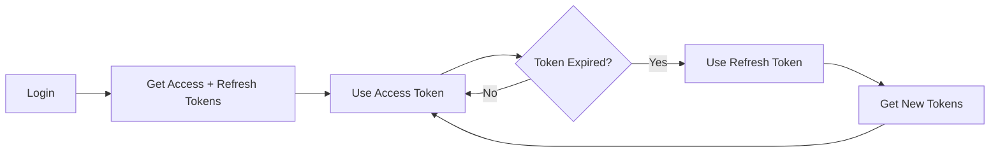

# MyBudget API Documentation

## Table of Contents
1. [Overview](#overview)
2. [Authentication](#authentication)
3. [Rate Limiting](#rate-limiting)
4. [Error Handling](#error-handling)
5. [API Endpoints](#api-endpoints)
   - [Authentication](#authentication-endpoints)
   - [User Management](#user-management-endpoints)
   - [Transactions](#transaction-endpoints)
   - [Budgets](#budget-endpoints)
   - [Goals](#goal-endpoints)
   - [Dashboard](#dashboard-endpoints)
   - [Insights](#insights-endpoints)
   - [System](#system-endpoints)

## Overview

The MyBudget API is a RESTful API that provides comprehensive personal finance management capabilities. All API endpoints are prefixed with `/api` and return JSON responses.

### Base URL
```
Production: https://api.mybudget.com
Development: http://localhost:3000
```

### Headers
All requests should include:
```http
Content-Type: application/json
Accept: application/json
Authorization: Bearer <access_token>
```

## Authentication

MyBudget uses JWT (JSON Web Token) based authentication with refresh tokens.

### Token Types

1. **Access Token**
   - Used for API requests
   - Expires in 7 days (configurable)
   - Contains user ID, email, and token version

2. **Refresh Token**
   - Used to obtain new access tokens
   - Expires in 30 days
   - Can be revoked by incrementing user's token version

### Token Lifecycle



## Rate Limiting

### Standard Limits

| Endpoint Type | Window | Requests | Burst |
|--------------|---------|----------|-------|
| Authentication | 15 min | 5 | No |
| API (General) | 1 min | 60 | Yes |
| Upload | 1 min | 10 | No |
| Public | 1 min | 30 | No |

### Adaptive Rate Limiting

The API uses adaptive rate limiting based on user behavior:

- **Trusted Users**: 2x standard limits
- **Suspicious Users**: 0.5x standard limits
- **Bots/Crawlers**: Special limits apply

### Rate Limit Headers

```http
X-RateLimit-Limit: 60
X-RateLimit-Remaining: 45
X-RateLimit-Reset: 2024-01-01T12:00:00Z
Retry-After: 30
```

## Error Handling

### Error Response Format

```json
{
  "success": false,
  "error": {
    "message": "Human-readable error message",
    "code": "ERROR_CODE",
    "status": 400,
    "details": {}, // Optional additional context
    "timestamp": "2024-01-01T12:00:00Z",
    "requestId": "uuid-v4"
  }
}
```

### Common Error Codes

| Code | Status | Description |
|------|--------|-------------|
| `VALIDATION_ERROR` | 400 | Invalid request data |
| `UNAUTHORIZED` | 401 | Missing or invalid authentication |
| `FORBIDDEN` | 403 | Insufficient permissions |
| `NOT_FOUND` | 404 | Resource not found |
| `RATE_LIMITED` | 429 | Too many requests |
| `INTERNAL_ERROR` | 500 | Server error |

## API Endpoints

### Authentication Endpoints

#### POST /api/auth/register
Create a new user account.

**Request:**
```json
{
  "email": "user@example.com",
  "password": "SecurePassword123!",
  "name": "John Doe"
}
```

**Response:**
```json
{
  "success": true,
  "data": {
    "user": {
      "id": "uuid",
      "email": "user@example.com",
      "name": "John Doe",
      "createdAt": "2024-01-01T12:00:00Z"
    },
    "token": "jwt.access.token",
    "refreshToken": "jwt.refresh.token",
    "expiresIn": "7d"
  }
}
```

**Validation:**
- Email: Valid email format, unique
- Password: Min 8 chars, must include uppercase, lowercase, number, special char
- Name: 2-100 characters

---

#### POST /api/auth/login
Authenticate user and receive tokens.

**Request:**
```json
{
  "email": "user@example.com",
  "password": "SecurePassword123!"
}
```

**Response:**
```json
{
  "success": true,
  "data": {
    "user": {
      "id": "uuid",
      "email": "user@example.com",
      "name": "John Doe"
    },
    "token": "jwt.access.token",
    "refreshToken": "jwt.refresh.token",
    "expiresIn": "7d"
  }
}
```

**Rate Limit:** 5 requests per 15 minutes

---

#### POST /api/auth/refresh
Refresh access token using refresh token.

**Request:**
```json
{
  "refreshToken": "jwt.refresh.token"
}
```

**Response:**
```json
{
  "success": true,
  "data": {
    "accessToken": "jwt.access.token",
    "refreshToken": "jwt.refresh.token",
    "expiresIn": "7d"
  }
}
```

**Rate Limit:** 10 requests per hour

---

#### POST /api/auth/logout
Invalidate current session.

**Request:**
```json
{}
```

**Response:**
```json
{
  "success": true,
  "message": "Logged out successfully"
}
```

---

#### POST /api/auth/reset-password
Request password reset.

**Request:**
```json
{
  "email": "user@example.com"
}
```

**Response:**
```json
{
  "success": true,
  "message": "Password reset email sent"
}
```

**Rate Limit:** 3 requests per hour

---

### User Management Endpoints

#### GET /api/user/profile
Get current user profile.

**Response:**
```json
{
  "success": true,
  "data": {
    "id": "uuid",
    "email": "user@example.com",
    "name": "John Doe",
    "createdAt": "2024-01-01T12:00:00Z",
    "settings": {
      "currency": "USD",
      "timezone": "America/New_York",
      "notifications": {
        "email": true,
        "push": false
      }
    }
  }
}
```

---

#### PUT /api/user/profile
Update user profile.

**Request:**
```json
{
  "name": "Jane Doe",
  "settings": {
    "currency": "EUR",
    "timezone": "Europe/London"
  }
}
```

**Response:**
```json
{
  "success": true,
  "data": {
    "id": "uuid",
    "email": "user@example.com",
    "name": "Jane Doe",
    "settings": {
      "currency": "EUR",
      "timezone": "Europe/London"
    }
  }
}
```

---

### Transaction Endpoints

#### GET /api/transactions
List user transactions with pagination and filtering.

**Query Parameters:**
- `page` (integer): Page number (default: 1)
- `limit` (integer): Items per page (default: 20, max: 100)
- `type` (string): Filter by type (income/expense)
- `category` (string): Filter by category
- `startDate` (string): Filter by date range start (ISO 8601)
- `endDate` (string): Filter by date range end (ISO 8601)
- `search` (string): Search in description

**Response:**
```json
{
  "success": true,
  "data": {
    "transactions": [
      {
        "id": "uuid",
        "userId": "uuid",
        "amount": 150.50,
        "type": "expense",
        "category": "groceries",
        "description": "Weekly shopping",
        "date": "2024-01-01",
        "tags": ["food", "essentials"],
        "createdAt": "2024-01-01T12:00:00Z"
      }
    ],
    "pagination": {
      "page": 1,
      "limit": 20,
      "total": 150,
      "totalPages": 8
    }
  }
}
```

---

#### POST /api/transactions
Create a new transaction.

**Request:**
```json
{
  "amount": 150.50,
  "type": "expense",
  "category": "groceries",
  "description": "Weekly shopping",
  "date": "2024-01-01",
  "tags": ["food", "essentials"]
}
```

**Response:**
```json
{
  "success": true,
  "data": {
    "id": "uuid",
    "userId": "uuid",
    "amount": 150.50,
    "type": "expense",
    "category": "groceries",
    "description": "Weekly shopping",
    "date": "2024-01-01",
    "tags": ["food", "essentials"],
    "createdAt": "2024-01-01T12:00:00Z"
  }
}
```

**Validation:**
- Amount: Positive number, max 1,000,000
- Type: Must be 'income' or 'expense'
- Category: Valid category from predefined list
- Description: 1-255 characters
- Date: Valid date, not in future
- Tags: Array of strings, max 10 tags

---

#### PUT /api/transactions/:id
Update a transaction.

**Request:**
```json
{
  "amount": 175.00,
  "description": "Weekly shopping + extras"
}
```

**Response:**
```json
{
  "success": true,
  "data": {
    "id": "uuid",
    "amount": 175.00,
    "description": "Weekly shopping + extras",
    "updatedAt": "2024-01-01T12:30:00Z"
  }
}
```

---

#### DELETE /api/transactions/:id
Delete a transaction.

**Response:**
```json
{
  "success": true,
  "message": "Transaction deleted successfully"
}
```

---

### Budget Endpoints

#### GET /api/budgets
Get user budgets.

**Response:**
```json
{
  "success": true,
  "data": {
    "budgets": [
      {
        "id": "uuid",
        "category": "groceries",
        "amount": 500.00,
        "period": "monthly",
        "spent": 325.50,
        "remaining": 174.50,
        "percentage": 65.1,
        "startDate": "2024-01-01",
        "endDate": "2024-01-31"
      }
    ]
  }
}
```

---

#### POST /api/budgets
Create a new budget.

**Request:**
```json
{
  "category": "groceries",
  "amount": 500.00,
  "period": "monthly"
}
```

**Response:**
```json
{
  "success": true,
  "data": {
    "id": "uuid",
    "category": "groceries",
    "amount": 500.00,
    "period": "monthly",
    "createdAt": "2024-01-01T12:00:00Z"
  }
}
```

---

### Goal Endpoints

#### GET /api/goals
Get user savings goals.

**Response:**
```json
{
  "success": true,
  "data": {
    "goals": [
      {
        "id": "uuid",
        "name": "Emergency Fund",
        "targetAmount": 10000.00,
        "currentAmount": 2500.00,
        "targetDate": "2024-12-31",
        "progress": 25.0,
        "status": "active",
        "createdAt": "2024-01-01T12:00:00Z"
      }
    ]
  }
}
```

---

#### POST /api/goals
Create a new savings goal.

**Request:**
```json
{
  "name": "Emergency Fund",
  "targetAmount": 10000.00,
  "targetDate": "2024-12-31",
  "description": "6 months of expenses"
}
```

**Response:**
```json
{
  "success": true,
  "data": {
    "id": "uuid",
    "name": "Emergency Fund",
    "targetAmount": 10000.00,
    "currentAmount": 0,
    "targetDate": "2024-12-31",
    "createdAt": "2024-01-01T12:00:00Z"
  }
}
```

---

### Dashboard Endpoints

#### GET /api/dashboard
Get dashboard summary data.

**Response:**
```json
{
  "success": true,
  "data": {
    "overview": {
      "totalBalance": 5250.00,
      "monthlyIncome": 5000.00,
      "monthlyExpenses": 3500.00,
      "savingsRate": 30.0
    },
    "recentTransactions": [...],
    "budgetStatus": [...],
    "goalProgress": [...],
    "insights": {
      "topCategories": [...],
      "savingsTrend": [...],
      "alerts": [...]
    }
  }
}
```

---

### Insights Endpoints

#### GET /api/insights
Get financial insights and analytics.

**Query Parameters:**
- `period` (string): Time period (week/month/quarter/year)
- `type` (string): Insight type (spending/savings/trends)

**Response:**
```json
{
  "success": true,
  "data": {
    "insights": [
      {
        "type": "spending_trend",
        "title": "Grocery spending up 15%",
        "description": "Your grocery expenses increased compared to last month",
        "severity": "info",
        "data": {
          "current": 575.00,
          "previous": 500.00,
          "change": 15.0
        }
      }
    ]
  }
}
```

---

### System Endpoints

#### GET /api/health
Health check endpoint.

**Response:**
```json
{
  "status": "healthy",
  "timestamp": "2024-01-01T12:00:00Z",
  "version": "1.0.0",
  "services": {
    "database": "healthy",
    "redis": "healthy",
    "storage": "healthy"
  }
}
```

**Note:** This endpoint does not require authentication.

---

#### GET /api/metrics
Get system metrics (admin only).

**Response:**
```json
{
  "success": true,
  "data": {
    "requests": {
      "total": 1000000,
      "rate": 150
    },
    "performance": {
      "avgResponseTime": 45,
      "p99ResponseTime": 200
    },
    "security": {
      "blockedRequests": 1250,
      "rateLimitHits": 500
    }
  }
}
```

## WebSocket Events

MyBudget supports real-time updates via WebSocket connections.

### Connection
```javascript
const ws = new WebSocket('wss://api.mybudget.com/ws');
ws.send(JSON.stringify({
  type: 'auth',
  token: 'jwt.access.token'
}));
```

### Events

#### Transaction Update
```json
{
  "type": "transaction.update",
  "data": {
    "id": "uuid",
    "amount": 150.50,
    "type": "expense"
  }
}
```

#### Budget Alert
```json
{
  "type": "budget.alert",
  "data": {
    "budgetId": "uuid",
    "category": "groceries",
    "percentage": 90,
    "message": "You've used 90% of your grocery budget"
  }
}
```

## SDK Examples

### JavaScript/TypeScript
```typescript
import { MyBudgetClient } from '@mybudget/sdk';

const client = new MyBudgetClient({
  apiKey: 'your-api-key',
  environment: 'production'
});

// Create transaction
const transaction = await client.transactions.create({
  amount: 150.50,
  type: 'expense',
  category: 'groceries',
  description: 'Weekly shopping'
});
```

### Python
```python
from mybudget import MyBudgetClient

client = MyBudgetClient(
    api_key='your-api-key',
    environment='production'
)

# Create transaction
transaction = client.transactions.create(
    amount=150.50,
    type='expense',
    category='groceries',
    description='Weekly shopping'
)
```

### cURL
```bash
curl -X POST https://api.mybudget.com/api/transactions \
  -H "Authorization: Bearer your-token" \
  -H "Content-Type: application/json" \
  -d '{
    "amount": 150.50,
    "type": "expense",
    "category": "groceries",
    "description": "Weekly shopping"
  }'
```

## Best Practices

1. **Authentication**
   - Store tokens securely
   - Refresh tokens before expiry
   - Never expose tokens in URLs

2. **Rate Limiting**
   - Implement exponential backoff
   - Cache responses when possible
   - Use webhooks for real-time updates

3. **Error Handling**
   - Always check response status
   - Handle specific error codes
   - Log errors for debugging

4. **Performance**
   - Use pagination for lists
   - Request only needed fields
   - Batch operations when possible

## Changelog

### v1.0.0 (2024-01-01)
- Initial API release
- JWT authentication with refresh tokens
- Complete transaction management
- Budget and goal tracking
- Real-time WebSocket support

---

*For additional support, contact api@mybudget.com*