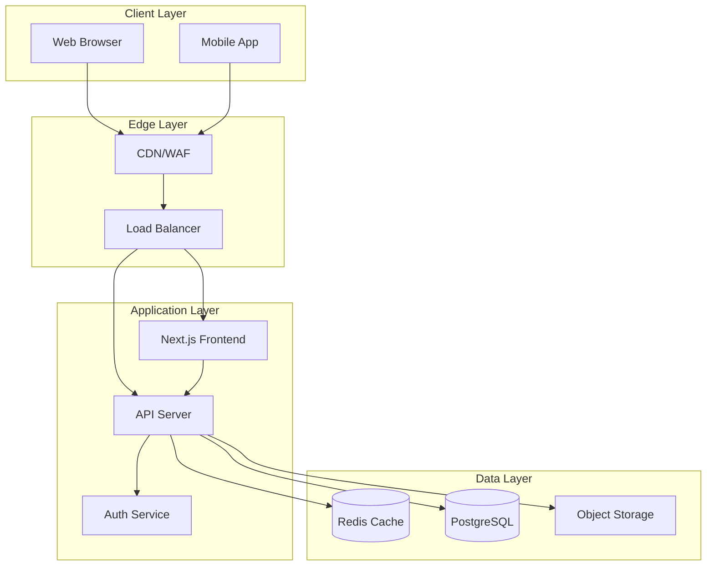

# MyBudget Security Documentation & Threat Model

## Table of Contents
1. [Security Architecture Overview](#security-architecture-overview)
2. [Threat Model](#threat-model)
3. [Security Controls](#security-controls)
4. [Security Best Practices](#security-best-practices)
5. [Incident Response](#incident-response)
6. [Compliance & Privacy](#compliance--privacy)

## Security Architecture Overview

### System Components



### Security Layers

1. **Network Security**
   - WAF (Web Application Firewall)
   - DDoS Protection
   - TLS 1.3 encryption
   - IP Allowlisting for admin endpoints

2. **Application Security**
   - JWT-based authentication with refresh tokens
   - Rate limiting on all endpoints
   - Input validation and sanitization
   - CSP (Content Security Policy) headers
   - CORS protection

3. **Data Security**
   - Encryption at rest (AES-256)
   - Encryption in transit (TLS 1.3)
   - Database field-level encryption for PII
   - Secure key management

## Threat Model

### STRIDE Analysis

#### 1. Spoofing Identity

**Threats:**
- Stolen JWT tokens
- Session hijacking
- Phishing attacks
- Credential stuffing

**Mitigations:**
- Token versioning and revocation
- Secure token storage (httpOnly cookies)
- Multi-factor authentication (planned)
- Brute force protection via rate limiting

#### 2. Tampering with Data

**Threats:**
- SQL injection
- XSS attacks
- CSRF attacks
- Man-in-the-middle attacks

**Mitigations:**
- Parameterized queries
- Input validation and sanitization
- CSRF tokens
- TLS encryption
- Integrity checks

#### 3. Repudiation

**Threats:**
- Users denying actions
- Insufficient logging
- Log tampering

**Mitigations:**
- Comprehensive audit logging
- Immutable log storage
- User action tracking
- Timestamp verification

#### 4. Information Disclosure

**Threats:**
- Data breaches
- Error message leakage
- Directory traversal
- Insecure direct object references

**Mitigations:**
- Generic error messages in production
- Proper access controls
- Data encryption
- Secure file handling

#### 5. Denial of Service

**Threats:**
- DDoS attacks
- Resource exhaustion
- Rate limit bypass
- Database connection pool exhaustion

**Mitigations:**
- Rate limiting
- Resource limits
- Circuit breakers
- Auto-scaling
- Connection pooling

#### 6. Elevation of Privilege

**Threats:**
- Privilege escalation
- JWT manipulation
- Admin endpoint exposure
- Insecure defaults

**Mitigations:**
- Role-based access control
- JWT signature verification
- Admin endpoint protection
- Secure configuration

### Attack Vectors

| Vector | Risk Level | Mitigation Status |
|--------|-----------|------------------|
| SQL Injection | High | ✅ Mitigated |
| XSS | High | ✅ Mitigated |
| CSRF | Medium | ✅ Mitigated |
| Authentication Bypass | High | ✅ Mitigated |
| Session Fixation | Medium | ✅ Mitigated |
| Clickjacking | Low | ✅ Mitigated |
| XXE | Low | ✅ Mitigated |
| SSRF | Medium | ⚠️ Partial |
| File Upload | Medium | ✅ Mitigated |
| Rate Limit Bypass | Medium | ✅ Mitigated |

## Security Controls

### Authentication & Authorization

```typescript
// JWT Token Structure
{
  "userId": "uuid",
  "email": "user@example.com",
  "tokenVersion": 1,
  "passwordChangedAt": "2024-01-01T00:00:00Z",
  "iat": 1234567890,
  "exp": 1234567890
}
```

**Controls:**
- Minimum 32-character JWT secret
- Token expiration (7 days access, 30 days refresh)
- Token version tracking
- Password change invalidation
- Secure token transmission

### Rate Limiting

| Endpoint | Window | Max Requests | Fail Mode |
|----------|---------|--------------|-----------|
| /api/auth/login | 15 min | 5 | Closed |
| /api/auth/register | 1 hour | 3 | Closed |
| /api/auth/refresh | 1 hour | 10 | Closed |
| /api/auth/reset-password | 1 hour | 3 | Closed |
| /api/transactions | 1 min | 100 | Closed |
| /api/upload | 1 min | 10 | Closed |
| Default | 1 min | 60 | Open |

### Input Validation

All inputs are validated using Zod schemas:

```typescript
// Example: Transaction Input Validation
const transactionSchema = z.object({
  amount: z.number().positive().max(1000000),
  description: z.string().min(1).max(255),
  category: z.enum(['income', 'expense']),
  date: z.string().datetime(),
  tags: z.array(z.string()).max(10).optional()
});
```

### Security Headers

```
Strict-Transport-Security: max-age=31536000; includeSubDomains; preload
X-Frame-Options: DENY
X-Content-Type-Options: nosniff
Referrer-Policy: strict-origin-when-cross-origin
Permissions-Policy: camera=(), microphone=(), geolocation=()
Content-Security-Policy: default-src 'self'; script-src 'self' 'nonce-{NONCE}'
```

## Security Best Practices

### Development

1. **Code Review**
   - All PRs require security review
   - Automated security scanning
   - Dependency vulnerability checks

2. **Secret Management**
   - No secrets in code
   - Environment variable validation
   - Secure secret rotation

3. **Testing**
   - Security test suite
   - Penetration testing
   - Load testing

### Deployment

1. **Infrastructure**
   - Principle of least privilege
   - Network segmentation
   - Regular security updates

2. **Monitoring**
   - Real-time security alerts
   - Anomaly detection
   - Performance monitoring

3. **Backup & Recovery**
   - Automated backups
   - Encryption of backups
   - Regular recovery testing

## Incident Response

### Response Plan

1. **Detection**
   - Automated alerting
   - Log analysis
   - User reports

2. **Assessment**
   - Severity classification
   - Impact analysis
   - Root cause analysis

3. **Containment**
   - Isolate affected systems
   - Revoke compromised credentials
   - Block malicious IPs

4. **Eradication**
   - Remove threats
   - Patch vulnerabilities
   - Update security controls

5. **Recovery**
   - Restore services
   - Verify integrity
   - Monitor for reoccurrence

6. **Post-Mortem**
   - Document incident
   - Update procedures
   - Implement improvements

### Contact Information

| Role | Contact | Availability |
|------|---------|--------------|
| Security Lead | security@mybudget.com | 24/7 |
| DevOps Lead | devops@mybudget.com | 24/7 |
| CTO | cto@mybudget.com | Business hours |

## Compliance & Privacy

### Data Protection

1. **Personal Data**
   - Encrypted at rest
   - Minimal data collection
   - User consent required
   - Right to deletion

2. **Financial Data**
   - PCI DSS compliance (planned)
   - Transaction encryption
   - Secure data transmission
   - Audit trails

3. **GDPR Compliance**
   - Privacy by design
   - Data portability
   - Consent management
   - Breach notification

### Security Audits

| Audit Type | Frequency | Last Performed | Next Scheduled |
|------------|-----------|----------------|----------------|
| Code Review | Continuous | Daily | Ongoing |
| Penetration Test | Quarterly | 2024-Q1 | 2024-Q2 |
| Vulnerability Scan | Weekly | 2024-W10 | 2024-W11 |
| Compliance Audit | Annual | 2023 | 2024 |

## Security Checklist

### Pre-Deployment

- [ ] Environment variables validated
- [ ] Security headers configured
- [ ] Rate limiting enabled
- [ ] Logging configured
- [ ] Monitoring enabled
- [ ] Backups configured
- [ ] SSL certificates valid
- [ ] Dependencies updated

### Post-Deployment

- [ ] Security scan completed
- [ ] Penetration test passed
- [ ] Performance tested
- [ ] Monitoring verified
- [ ] Alerts configured
- [ ] Documentation updated
- [ ] Team trained
- [ ] Incident response tested

## Appendix

### Security Tools

1. **Development**
   - ESLint security plugins
   - Snyk for dependency scanning
   - OWASP ZAP for testing

2. **Production**
   - Sentry for error tracking
   - ELK stack for logging
   - Prometheus for monitoring

### References

- [OWASP Top 10](https://owasp.org/www-project-top-ten/)
- [NIST Cybersecurity Framework](https://www.nist.gov/cyberframework)
- [CWE/SANS Top 25](https://cwe.mitre.org/top25/)
- [GDPR Guidelines](https://gdpr.eu/)

---

*This document is classified as: Internal Use Only*  
*Last Updated: [TODAY'S DATE]*  
*Version: 1.0*